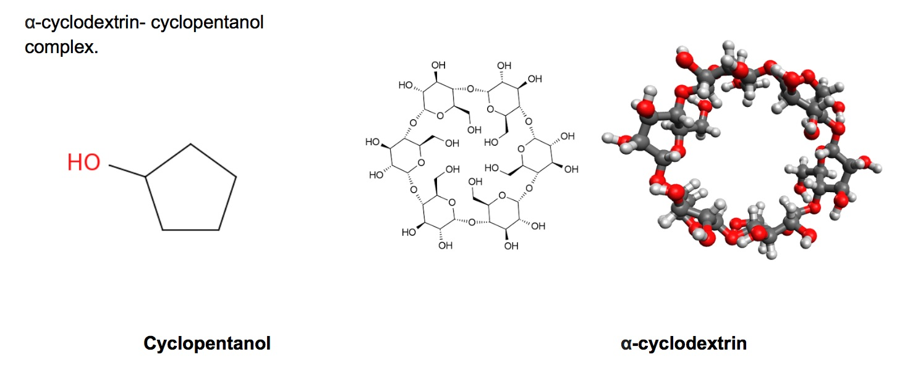

# Sample host-guest binding data from Léa El Khoury (Mobley Lab)

This contains alpha-cyclodextrin/cyclopentanol sample binding data

## About the calculations

These calculations (for the host and guest displayed above) were done to examine cyclopentanol binding to the host alpha-cyclodextrin in water. They are parallel to the hydration free energy calculation for cyclopentanol in this repository in `solvation-free-energies/sample_files/hydration.tar.gz`.
The calculations presented here are (for storage reasons/illustration) quite brief, just 500 iterations.
This is far too short for an accurate binding free energy estimate in general.
We obtain the following values from this and longer simulations:
- 500 iterations: -4.030 +- 0.242 kcal/mol
- 1000 iterations: -3.711 +- 0.181 kcal/mol
- 2000 iterations: -3.779 +- 0.118 kcal/mol
- 4000 iterations: -3.881 +- 0.081 kcal/mol
(Thus these values in this particular case appear to converge fairly quickly.)

### Manifest:
This folder contains:
- `harmonic.yaml`:   Yaml script for these calculations, using harmonic restraints
- `input`: Simulation inputs; cyclopentanol (same molecule as for the hydration free energy calculation) was taken from `https://github.com/MobleyLab/benchmarksets/input_files/cd-set1/mol2/guest-4.mol2`(renumbering residue 7 to 1); for α-cyclodextrin: we obtained the input mol2 from `https://github.com/MobleyLab/benchmarksets/input_files/cd-set1/mol2/host-acd.mol2` and, to avoid a bug with some of the tools utilized (requiring cyclic molecules not have multiple residues) we renumbered residues 2,3,4,5 and 6 as residue 1.
- `harmonic-out`: Output files, as well as analysis jupyter notebook, etc.

### Analysis

To analyze, go to `harmonic-out` and:
- `yank analyze report --store=experiments --output=harmonic.ipynb`
- Execute the notebook and evaluate the cells
- For the record, a copy of the executed notebook is stored in html at [`harmonic.html`](hydration-out/hydration_1ns.html)

Trajectory extraction can be done by commands like `yank analyze extract-trajectory --netcdf=solvent1.nc --trajectory=complex.pdb --state=0`, for example.
